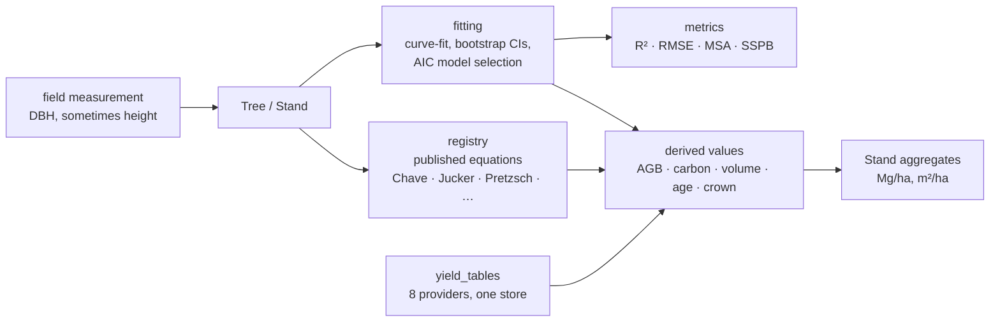

# pylometree — A Python Toolkit for Tree Allometry

[](https://doi.org/10.5281/zenodo.21509863)
[](https://www.gnu.org/licenses/agpl-3.0)

Fit, evaluate and look up allometric equations for trees — height–diameter relationships,
above- and below-ground biomass, crown structure, stem volume, and height–age growth.

A forest inventory gives you diameters and sometimes heights. Nearly everything else a
forester or a model wants — biomass, carbon, volume, age, crown dimensions — has to be
derived through published equations, each with its own variables, units and region of
validity. pylometree makes those equations first-class objects: fit your own, or pull a
published one out of the registry and know exactly what it expects.



## Features

| Module | Capability |
|---|---|
| `pylometree.models.hd` | 12 H–D equation forms (Chapman-Richards, Gompertz, Weibull, …) |
| `pylometree.models.biomass` | Power-law M1–M4, Chave 2014 pantropical, Musa NSUR |
| `pylometree.models.crown` | Crown-area/height → AGB (Jucker 2017, Htoo 2025) |
| `pylometree.models.volume` | Form-factor and power-law stem volume |
| `pylometree.fitting` | `scipy` curve-fit wrapper, bootstrap CIs, AIC-based model selection |
| `pylometree.metrics` | R², RMSE, MAE, bias, AIC, AICc, **MSA**, **SSPB** |
| `pylometree.registry` | Searchable model registry pre-loaded with published equations |
| `pylometree.data` | `Tree` and `Stand` dataclasses with plot-level aggregation |
| `pylometree.io` | Load trees from CSV or pandas DataFrame |
| `pylometree.yield_tables` | Multi-source yield table ingestion, store management, and resolution |

## Installation

```bash
pip install pylometree                 # NumPy, SciPy, pandas
pip install "pylometree[ml]"           # + scikit-learn, CatBoost
pip install "pylometree[dev]"          # + pytest, pytest-cov
```

Requires **Python ≥ 3.12**.

## Quick start

Fit a height–diameter model and predict with it:

```python
import numpy as np
from pylometree.fitting import fit_model, select_model

dbh    = np.array([5, 8, 12, 18, 24, 30, 38, 45])   # cm
height = np.array([6, 9, 13, 17, 21, 24, 27, 29])   # m

result = fit_model(dbh, height, model_name="chapman_richards")
# FitResult('chapman_richards', R²=0.998, converged=True)
h_pred = result.predict(np.array([10, 20, 30]))

# or let AIC choose among all 12 forms
best_name, best_result, all_results = select_model(dbh, height)
```

Estimate biomass and carbon for a stand from a published equation:

```python
from pylometree.data import Tree, Stand
from pylometree.registry import registry

chave = registry.get("chave2014_pantropical")
trees = [Tree(dbh=d, height=h, wood_density=0.65)
         for d, h in zip([15, 20, 25, 18, 22], [12, 17, 20, 14, 18])]
stand = Stand(trees=trees, plot_area=0.1)

for t in stand:
    t.estimate_agb(chave)

print(f"{stand.agb_mg_ha:.2f} Mg/ha, {stand.carbon_stock_mg_ha:.2f} Mg C/ha")
```

Registering your own equation, loading a plot from CSV, and the yield-table workflow are in
**[RUNBOOK.md](RUNBOOK.md)**.

## Included models

**H–D forms** (`pylometree.models.hd`): `chapman_richards`, `exponential_3p`, `gompertz`,
`hyperbolic`, `michaelis_menten`, `power_law`, `log_linear`, `logistic_3p`, `weibull_4p`,
`korf`, `von_bertalanffy` — equations in [docs/api-reference.md](docs/api-reference.md).

**Published registry entries:**

| Model ID | Type | Source |
|---|---|---|
| `chave2014_pantropical` | `agb` | Chave et al. (2014) GCB |
| `jucker2017_crown_agb` | `crown_agb` | Jucker et al. (2017) GCB |
| `laskar2020_musa_agb` | `agb` | Laskar et al. (2020) JEM |
| `laskar2020_musa_hd_exponential` | `hd` | Laskar et al. (2020) |
| `chapman_richards_generic_hd` | `hd` | Richards (1959) |
| `pretzsch2025_*_height_age` | `height_age` | Pretzsch et al. (2025) Trees |

## Design notes

- **Variable naming** follows the [allometric R package](https://allometric.org/) convention:
  `dsob` (diameter of stem outside bark, cm), `hst` (total stem height, m), `rho` (wood
  density, g/cm³). Equations from the R ecosystem then map across 1:1 with no renaming, and
  `dsob` cannot be confused with inside-bark `dsib`. **Units are the caller's
  responsibility** — pylometree never converts silently.
- **AGB back-transformation bias** is corrected using Sprugel (1983): $CF = e^{MSE/2}$.
- **MSA and SSPB** are forestry-specific accuracy metrics from Burt & Disney (*treeallom*),
  robust to the asymmetric multiplicative errors typical of biomass data — which is why they
  sit alongside R² rather than behind it.
- The registry uses **exact `model_type` matching** (`"agb"` will not match `"crown_agb"`);
  search by response variable with `registry.query(response="agb")` instead.

## Documentation

| You want | Read |
|----------|------|
| Install, fitting workflow, registry, yield tables, troubleshooting | [RUNBOOK.md](RUNBOOK.md) |
| Full API surface | [docs/api-reference.md](docs/api-reference.md) |
| Species coverage per equation family | [docs/species-reference.md](docs/species-reference.md) |
| Worked tutorials | [docs/tutorials/](docs/tutorials/) |
| Why these metrics, how equation selection is judged, where allometry sits in the twin | XR Future Forests Lab knowledge hub — `04-LOGIC-TIER/pylometree` |
| Contributing | [CONTRIBUTING.md](CONTRIBUTING.md) |
| Release history | [CHANGELOG.md](CHANGELOG.md) |

## References

- Chave J et al. (2014) Improved allometric models to estimate the aboveground biomass of tropical trees. *Global Change Biology* 20:3177–3190.
- Jucker T et al. (2017) Allometric equations for integrating remote sensing imagery into forest monitoring programmes. *Global Change Biology* 23:177–190.
- Pretzsch H et al. (2025) Estimating tree age from height using the extended Chapman-Richards function. *Trees*. doi:10.1007/s00468-025-02692-0
- Laskar S Y et al. (2020) Allometric models for estimating biomass of wild *Musa balbisiana*. *Journal of Environmental Management*.
- Burt A & Disney M — [treeallom R package](https://github.com/apburt/treeallom) (MSA, SSPB definitions).
- Sprugel D G (1983) Correcting for bias in log-transformed allometric equations. *Ecology* 64:209–210.

## License

Licensed under the
[GNU Affero General Public License v3.0 or later](https://www.gnu.org/licenses/agpl-3.0).
You are free to use, study, modify, and redistribute this software. If you run a modified
version on a server that users interact with over a network, you must make the modified
source available to those users. See [LICENSE](LICENSE).

## Citation

[](https://doi.org/10.5281/zenodo.21509863)
[](https://doi.org/10.5281/zenodo.22210761)

If you use pylometree in a publication, please cite it. See
[CITATION.cff](CITATION.cff) for machine-readable metadata, or:

> Sperlich, M. (2026). pylometree: A Python Toolkit for Tree Allometry.
> University of Freiburg.
> https://github.com/XRFutureForests/pylometree
