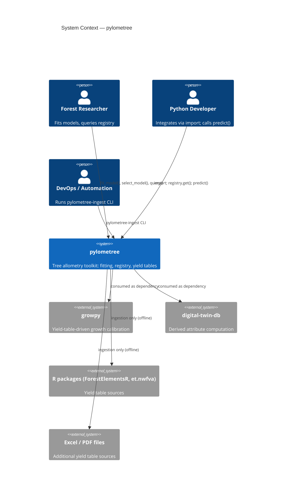
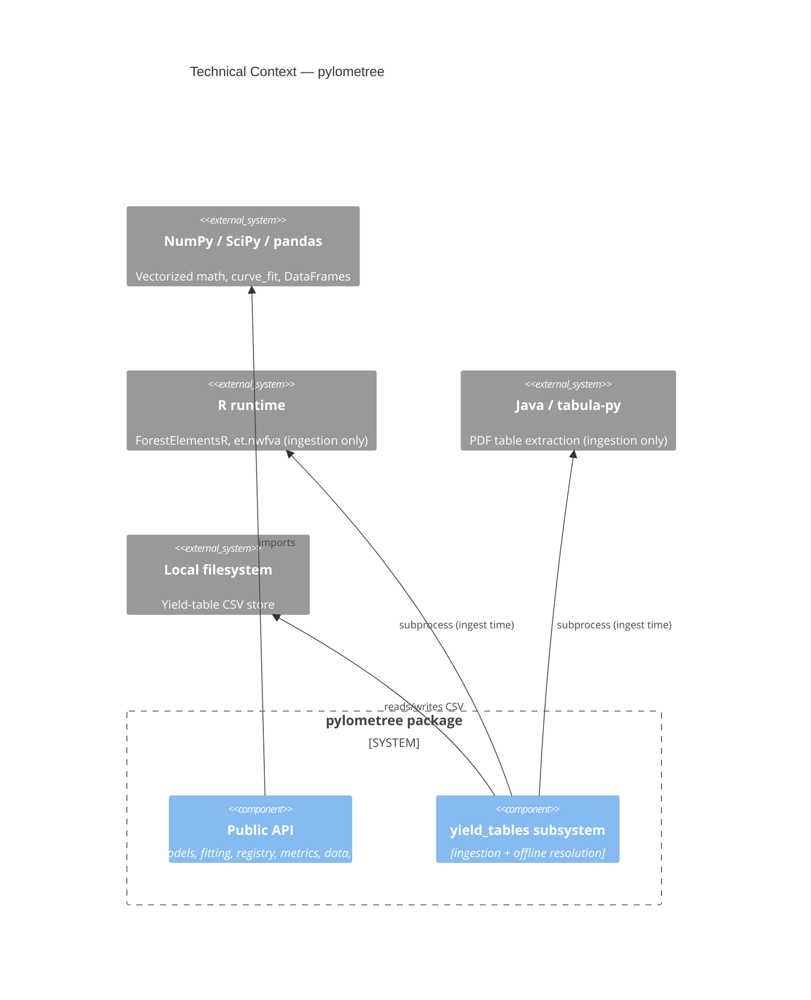
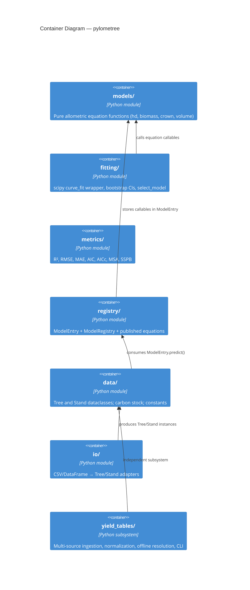
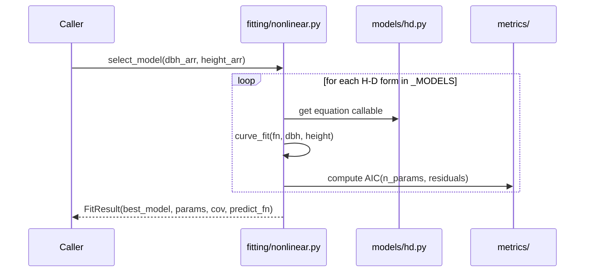
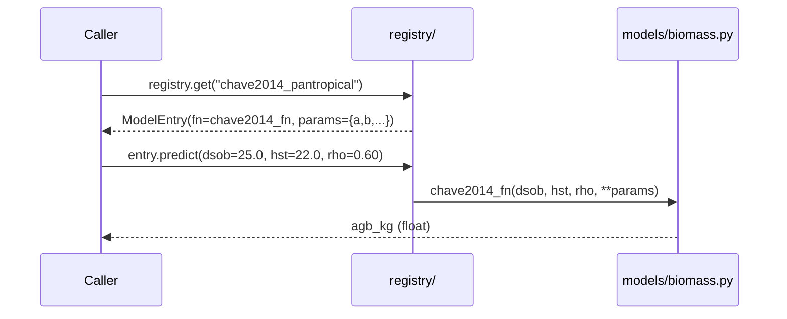
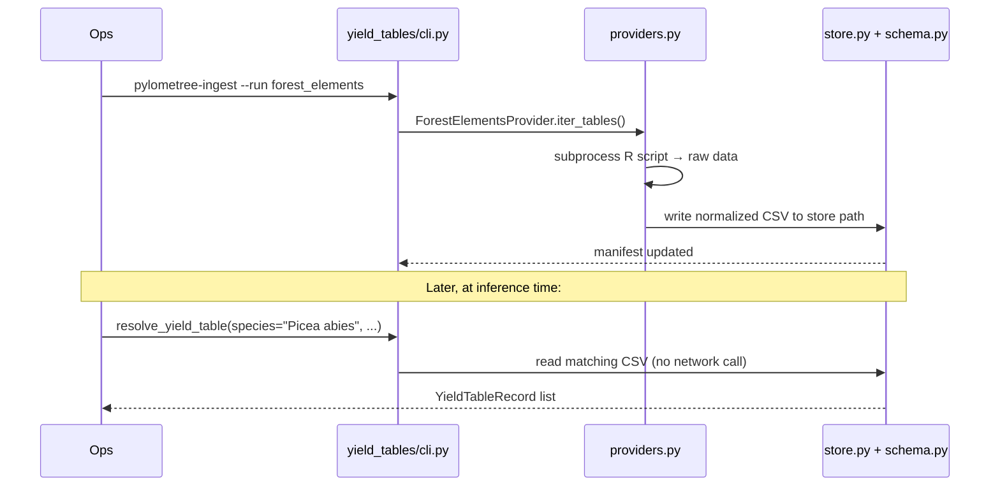

# Software Architecture Document: pylometree

**Document Version:** 1.0
**Date:** 2026-05-11
**Status:** Active
**Architecture Framework:** arc42 (simplified)
**Standard Compliance:** ISO/IEC/IEEE 42010:2022

<!-- SCOPE: System architecture (arc42 structure), C4 diagrams (Context, Container, Component), runtime scenarios, crosscutting concepts, ADR references ONLY. -->
<!-- DOC_KIND: explanation -->
<!-- DOC_ROLE: canonical -->
<!-- READ_WHEN: Read when you need the system model, layer boundaries, runtime flow, or design rationale. -->
<!-- SKIP_WHEN: Skip when you only need operational steps, API lookup, or yield-table schema details. -->
<!-- PRIMARY_SOURCES: docs/project/requirements.md, docs/project/tech_stack.md, docs/architecture.md, src/pylometree/ -->

<!-- NO_CODE_EXAMPLES: Architecture documentation describes DECISIONS and CONTRACTS, not implementations.
     FORBIDDEN: Import statements, function bodies, code blocks > 5 lines
     ALLOWED: Component responsibility tables, Mermaid diagrams, method signatures (1 line), ADR links -->

## Quick Navigation

- [Docs Hub](../README.md)
- [Requirements](requirements.md)
- [Tech Stack](tech_stack.md)

- [API Reference](../api-reference.md)

## Agent Entry

| Signal | Value |
|--------|-------|
| Purpose | Explains pylometree's layer structure, component boundaries, runtime behavior, and key design decisions. |
| Read When | You need mental models, layer boundaries, extension points, or cross-cutting concerns. |
| Skip When | You only need equation details, schema lookup, or ingestion commands. |
| Canonical | Yes |
| Next Docs | [Requirements](requirements.md), [Tech Stack](tech_stack.md), [API Reference](../api-reference.md) |
| Primary Sources | `src/pylometree/`, `docs/architecture.md`, `docs/project/requirements.md` |

---

## 1. Introduction and Goals

### 1.1 Requirements Overview

pylometree provides a composable Python toolkit for tree allometry. Core goals:

| Goal | Summary |
|------|---------|
| Equation library | Pure-function implementations of all major allometric forms |
| Model fitting | scipy-based fitting with bootstrap CIs and AIC selection |
| Registry | Searchable, metadata-rich store of published equations |
| Yield tables | Offline-first ingestion and resolution from 8 provider types |
| Domain objects | Tree and Stand dataclasses with carbon stock computation |

Full functional requirements: [requirements.md](requirements.md).

### 1.2 Quality Goals

| Priority | Quality Attribute | Target |
|----------|------------------|--------|
| 1 | Correctness | Published equations reproduce reference paper values within floating-point tolerance |
| 2 | Composability | Each layer is independently importable and testable |
| 3 | Traceability | Every pre-loaded model carries a full bibliographic citation |
| 4 | Offline reliability | Yield-table resolution never requires network access |
| 5 | Extensibility | New equations, providers, and metrics can be added without touching core layers |

### 1.3 Stakeholders

| Stakeholder | Concern |
|-------------|---------|
| Forest scientists | Correct equation implementations with traceable citations |
| Python developers (growpy, digital-twin-db) | Stable, importable API; clear layer boundaries |
| XR Future Forests Lab maintainers | Extensible without core changes; offline-first |

---

## 2. Constraints

### 2.1 Technical Constraints

| Constraint | Detail |
|------------|--------|
| Python 3.12+ | No earlier Python versions supported |
| Core deps only | numpy, scipy, pandas — no heavier ML deps for core equations |
| Git distribution | No PyPI publication (XRFF-131); consumed via git install |
| No implicit conversion | Callers are responsible for correct units (cm/m) |
| Offline-first | `resolve_yield_table()` reads only pre-ingested local CSV files |

### 2.2 Organizational Constraints

| Constraint | Detail |
|------------|--------|
| Academic citations | All pre-loaded models must carry full bibliographic references |
| Variable naming | allometric R package convention (dsob, hst, vsia, agb, bgb) |
| Strict type matching | Registry `model_type` is not coerced — callers use exact strings |

### 2.3 Conventions

| Convention | Detail |
|------------|--------|
| Style | Black 88-char line width, snake_case, type hints on public API |
| Testing | pytest, located in `tests/`, run with `pytest -v` |
| Package layout | src layout (`src/pylometree/`); setuptools with `find packages where=src` |

---

## 3. Context and Scope

### 3.1 Business Context

pylometree is a general-purpose library. It receives tree measurement data from callers and returns allometric estimates. It does not own any persistent database.



**External Interfaces:**

| Interface | Direction | Protocol | Purpose |
|-----------|-----------|----------|---------|
| R packages (ForestElementsR, et.nwfva) | In (ingestion only) | subprocess / R script | Yield-table extraction |
| Excel files | In (ingestion only) | openpyxl file read | Yield-table extraction |
| PDF files (FC Bulletin 75, USDA) | In (ingestion only) | tabula-py / Java | Yield-table extraction |
| Local CSV store | Read/Write | filesystem | Normalized yield-table cache |

### 3.2 Technical Context



---

## 4. Solution Strategy

### 4.1 Technology Decisions

| Decision | Choice | Rationale |
|----------|--------|-----------|
| Equation layer | Pure Python functions, NumPy-vectorized | Maximum composability; no state; easy testing |
| Curve fitting | scipy `curve_fit` | Industry-standard; convergence diagnostics; covariance matrix |
| Registry | In-memory dataclass dict | No I/O at query time; trivially serializable |
| Yield-table cache | Flat CSV files on local filesystem | Provider-agnostic; human-readable; offline-first |
| CLI | Python entry-point (`pylometree-ingest`) | Fits pip install workflow; no separate binary |
| Distribution | Git install only | Avoids PyPI overhead for research library (XRFF-131) |

### 4.2 Top-Level Decomposition

Seven independent layers arranged from pure math to I/O:

```
models/ → fitting/ → metrics/ → registry/ → data/ → io/ → yield_tables/
```

Each layer depends only on layers to its left (plus numpy/scipy/pandas). `yield_tables/` is self-contained and does not depend on other pylometree layers.

### 4.3 Approach to Quality Goals

| Quality Goal | Mechanism |
|-------------|-----------|
| Correctness | pytest suite; equations validated against published reference values |
| Composability | Each subpackage is independently importable (`from pylometree.models.hd import ...`) |
| Traceability | `ModelEntry.reference` carries full citation; `ModelEntry.pub_year` enables filtering |
| Offline reliability | `resolve_yield_table()` reads only pre-ingested local CSV; no `requests` dependency |
| Extensibility | `models/` uses `_MODELS` dict for auto-discovery; providers use `YieldProvider` ABC |

---

## 5. Building Block View

### 5.1 Level 1: System Context (C4 Model)

See Section 3.1 diagram above.

### 5.2 Level 2: Container Diagram (C4 Model)

pylometree is a single Python package (one "container"). Its logical sub-containers are the seven subpackages:



### 5.3 Level 3: Component Diagram — Key Subpackages

**registry/ components:**

| Component | File | Responsibility |
|-----------|------|----------------|
| `ModelEntry` | `registry/base.py` | Dataclass: id, type, fn, parameters, citation, units, species, region |
| `ModelRegistry` | `registry/base.py` | `register()`, `get()`, `query()` with multi-field AND filtering |
| Published equations | `registry/published.py` | Populates global `registry` singleton on import |

**yield_tables/ components:**

| Component | File | Responsibility |
|-----------|------|----------------|
| `YieldProvider` (ABC) | `providers.py` | Abstract base: `available()`, `iter_tables()` |
| Concrete providers | `providers.py` | ForestElements, NWFVA, CarbonET, UK FC, USDA, Parametric, etc. |
| `YieldTableRecord` | `record.py` | Normalized row dataclass |
| Canonical schema | `schema.py` | Column definitions and validation rules |
| Store management | `store.py` | Manifest: list, add, remove ingested tables |
| Resolver | `resolver.py` | `resolve_yield_table(species, region, site_index)` — offline lookup |
| CLI | `cli.py` | `pylometree-ingest` entry point |
| Species mapping | `species.py` | Name standardization across provider conventions |

---

## 6. Runtime View

### 6.1 Scenario: Fit H-D Model and Select Best Form



### 6.2 Scenario: Look Up a Published Model and Predict



### 6.3 Scenario: Yield Table Ingestion and Resolution



---

## 7. Crosscutting Concepts

### 7.1 Variable Naming Convention

All public function signatures and `ModelEntry` metadata use the `allometric` R package variable names:

| Variable | Meaning | Unit |
|----------|---------|------|
| `dsob` | Diameter outside bark at breast height | cm |
| `hst` | Total stem height | m |
| `vsia` | Stem volume inside bark | m³ |
| `agb` | Above-ground biomass | kg |
| `bgb` | Below-ground biomass | kg |

No implicit unit conversion is performed anywhere in the library.

### 7.2 Error Handling

| Layer | Approach |
|-------|----------|
| `registry.get()` | Raises `KeyError` with descriptive message if `model_id` not found |
| `ModelEntry.predict()` | Raises `ValueError` listing missing covariates |
| `fitting/` | Propagates `scipy.optimize.OptimizeWarning` and `RuntimeError` on convergence failure |
| `YieldProvider.available()` | Returns `False`; `status_message()` gives human-readable reason |
| CLI | Logs warnings via `logging`; exits with non-zero code on provider failure |

### 7.3 Configuration Management

| Config type | Location | Notes |
|-------------|----------|-------|
| Published model parameters | `registry/published.py` (source) | Hard-coded from original papers; version-controlled |
| Wood density defaults | `data/constants.py` | Carbon fraction = 0.47 (IPCC default) |
| Yield-table store path | `store.py` + env/config | Default: `~/.pylometree/yield_tables/` |
| Provider-specific paths | CLI `--config` flag | Passed as dict to `provider.iter_tables(config=...)` |

### 7.4 Extension Points

| Extension | Mechanism |
|-----------|-----------|
| New equation form | Add function to `models/<module>.py`; add to module's `_MODELS` dict |
| New published model | Call `registry.register(ModelEntry(...))` in `registry/published.py` |
| New yield-table provider | Subclass `YieldProvider` in `yield_tables/providers.py`; register in CLI dispatch |
| Custom metric | Add function to `metrics/`; no registration needed |

---

## 8. Architecture Decisions (ADRs)

No formal ADR directory exists yet. Key decisions recorded in source:

| Decision | Location | Summary |
|----------|----------|---------|
| Git-only distribution (no PyPI) | `pyproject.toml` + XRFF-131 | Avoids PyPI maintenance for research library |
| allometric R variable naming | `registry/base.py` docstring | Cross-language interoperability with R allometric ecosystem |
| Strict model_type matching | `registry/base.py:query()` | Prevents silent category conflation (agb vs crown_agb) |
| Offline-first yield tables | `yield_tables/resolver.py` | No runtime network calls; ingestion is a separate step |
| Sprugel 1983 bias correction applied explicitly | `models/biomass.py` docstrings | Prevents silent mis-use of log-space back-transformation |
| Src layout | `pyproject.toml` | Clean separation of package from project root |

---

## 9. Quality Requirements

### 9.1 Quality Tree

| Attribute | Scenario | Target |
|-----------|----------|--------|
| Correctness | Chave 2014 AGB for known inputs | Matches paper values within 1e-6 |
| Composability | Import any subpackage in isolation | No cross-layer circular imports |
| Traceability | Query registry for any model | `ModelEntry.reference` is non-empty string |
| Offline reliability | Call `resolve_yield_table()` with no network | Succeeds from local store |
| Extensibility | Add new H-D form | Only `models/hd.py` changes; no other files touched |

### 9.2 Quality Scenarios

| ID | Attribute | Stimulus | Expected Response |
|----|-----------|----------|-------------------|
| QS-1 | Correctness | `chave2014_fn(dsob=20, hst=18, rho=0.60)` | Matches paper table entry |
| QS-2 | Composability | `from pylometree.metrics import rmse` | Imports without pulling in fitting or registry |
| QS-3 | Traceability | `registry.get("chave2014_pantropical").reference` | Non-empty citation string |
| QS-4 | Offline reliability | `resolve_yield_table("Picea abies", ...)` with no internet | Returns records from local CSV store |
| QS-5 | Strict typing | `registry.query(model_type="agb")` | Does not return `crown_agb` entries |

---

## 10. Risks and Technical Debt

### 10.1 Known Technical Risks

| Risk | Impact | Likelihood |
|------|--------|-----------|
| No yield-table unit tests | Silent regression in normalization logic | Medium |
| R / Java subprocess ingestion | Provider availability varies by environment | Low (ingestion only) |
| No formal ADR directory | Design rationale scattered in code comments | Low |

### 10.2 Technical Debt

| Item | Type | Mitigation | Priority |
|------|------|-----------|---------|
| Yield-table tests missing | Test gap | Add `tests/test_yield_tables.py` | Medium |
| ADRs not formalized | Documentation debt | Create `docs/reference/adrs/` | Low |
| `io/` module has thin coverage | Test gap | Extend `tests/test_io.py` | Medium |

---

## 11. Glossary

| Term | Definition |
|------|------------|
| dsob | Diameter outside bark at breast height (cm) |
| hst | Total stem height (m) |
| agb | Above-ground biomass (kg or Mg) |
| ModelEntry | Dataclass: equation callable + parameters + citation + metadata |
| ModelRegistry | In-memory, searchable collection of ModelEntry objects |
| YieldProvider | ABC for yield-table data sources |
| FitResult | Return type of `fitting/nonlinear.py`: params, covariance, `.predict()` |
| MSA | Mean Squared Accuracy (Burt & Disney 2015) |
| SSPB | Scaled Sum of Prediction Bias (Burt & Disney 2015) |
| Sprugel 1983 | Bias correction for log-space back-transformation (Ecology 64:209) |

---

## 12. References

1. arc42 Architecture Template v8.2 — https://arc42.org/
2. C4 Model for Visualizing Software Architecture — https://c4model.com/
3. ISO/IEC/IEEE 42010:2022 — Architecture description
4. pylometree Requirements Document — [requirements.md](requirements.md)
5. pylometree original architecture overview — [../architecture.md](../architecture.md)
6. allometric R package variable conventions — https://allometric.github.io/allometric/

---

## Maintenance

**Last Updated:** 2026-05-11

**Update Triggers:**
- New subpackage or layer added
- Extension point mechanism changes
- New crosscutting concern (logging, serialization, etc.)
- Formal ADRs created (update Section 8)

**Verification:**
- [ ] C4 diagrams match current `src/pylometree/` subpackage structure
- [ ] Component table in Section 5.3 matches actual file names
- [ ] Extension point table in Section 7.4 reflects current `_MODELS` / ABC patterns
- [ ] Section 8 decisions reference actual source locations

---

## Revision History

| Version | Date | Author | Changes |
|---------|------|--------|---------|
| 1.0 | 2026-05-11 | ln-112-project-core-creator | Initial version |
